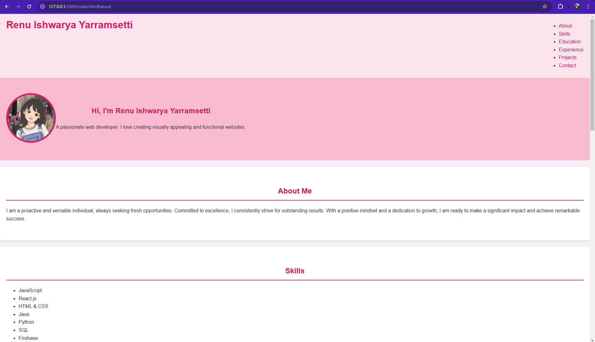

# My Profile Portfolio

This is my personal portfolio website built with HTML and CSS. It showcases my skills, education, experience, and projects.

## Sections

- **About**: A brief introduction about myself.
- **Skills**: A list of my technical skills.
- **Education**: My educational background.
- **Experience**: About my Work experience.
- **Projects**: Details of my projects.
- **Contact**: My contact information.

## Technologies Used

- HTML
- CSS

## Screenshot

